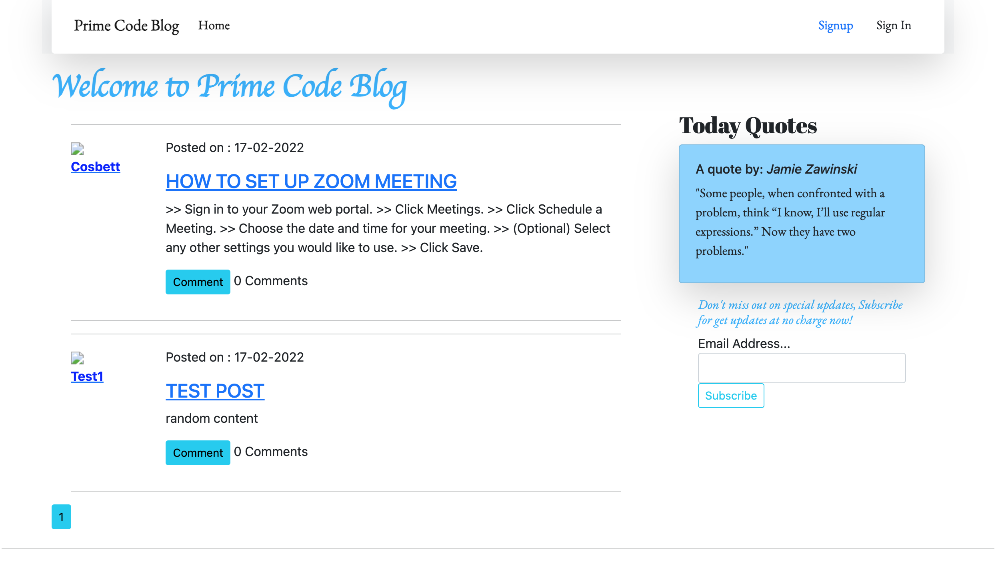

# Prime Code Blog

<a href="https://primeblogpost.herokuapp.com/" > Live Demo link</a> 

## Description
#### 
This is a personal blogging website where you i create and share my opinions and other users can read and comment on them. Also it has a feature that displays random quotes to inspire the users.

#### By **Cosmas Bett**
#### latest update **18th Feb 2022**

### Landing/home page

#### 
About
This is a  code blogging web application .

### How to Clone this application,
 1. Open the terminal
 2. Paste this <strong> git clone https://github.com/CosBett/Prime-Code-Blog </strong>
3. Open and edit with a code editor of your preference.

### Usage Instruction
1. Open your browser (preferably google chrome and active internet connection is required.) and paste the link below; https://primeblogpost.herokuapp.com/
 or <a href="https://primeblogpost.herokuapp.com/" > Click here</a> to acess the 
2. Depending on your needs you can easily maneuver around the page.
3. The page provides well label guidance to make usage easily understandable and interative.
4. In order for you to comment or post blog you are to sign up and sign in.
  ### User Stories
  The user is able to:
1. View the blog posts on the site.
2. Comment on blog posts.
3. View the most recent posts.
4. Receive email alert when a new post is made by    joining a subscription.
5. View random quotes on the site

  The writer is able to 
1. Sign up and log in to the site  
2. Create a blog from the application.
3. Delete comments that I find insulting or degrading.
4. Update or delete blogs I have created.

### Installation
This is a web application and there is no need to worry about installing it . This web application depends on a random quote endpoint for Quotes fetch.

## Known Bugs
The application has no known bugs at the moment. 

## Technologies Used
1. Python-Flask to consume newsapi, other app functionalities
2. Boostrap -for framework and overall web page responsiveness.
3. CSS- for extra page styling. 
4. HTML and Flask-jinja templating.

## Support and contact details

Incase of any issues or clarification, development, ideas, concerns or contributions to the code.  Kindly reach out through my email cosmasbett9@gmail.com.
## License

* Copyright 2022 Cosmas Bett

Permission is hereby granted, free of charge, to any person obtaining a copy of this software and associated documentation files (the "Software"), to deal in the Software without restriction, including without limitation the rights to use, copy, modify, merge, publish, distribute, sublicense, and/or sell copies of the Software, and to permit persons to whom the Software is furnished to do so, subject to the following conditions:
The above copyright notice and this permission notice shall be included in all copies or substantial portions of the Software.
THE SOFTWARE IS PROVIDED "AS IS", WITHOUT WARRANTY OF ANY KIND, EXPRESS OR IMPLIED, INCLUDING BUT NOT LIMITED TO THE WARRANTIES OF MERCHANTABILITY, FITNESS FOR A PARTICULAR PURPOSE AND NONINFRINGEMENT. IN NO EVENT SHALL THE AUTHORS OR COPYRIGHT HOLDERS BE LIABLE FOR ANY CLAIM, DAMAGES OR OTHER LIABILITY, WHETHER IN AN ACTION OF CONTRACT, TORT OR OTHERWISE, ARISING FROM, OUT OF OR IN CONNECTION WITH THE SOFTWARE OR THE USE OR OTHER DEALINGS IN THE SOFTWARE.
*
Copyright (c) 2022 **Cosmas Bett**
  